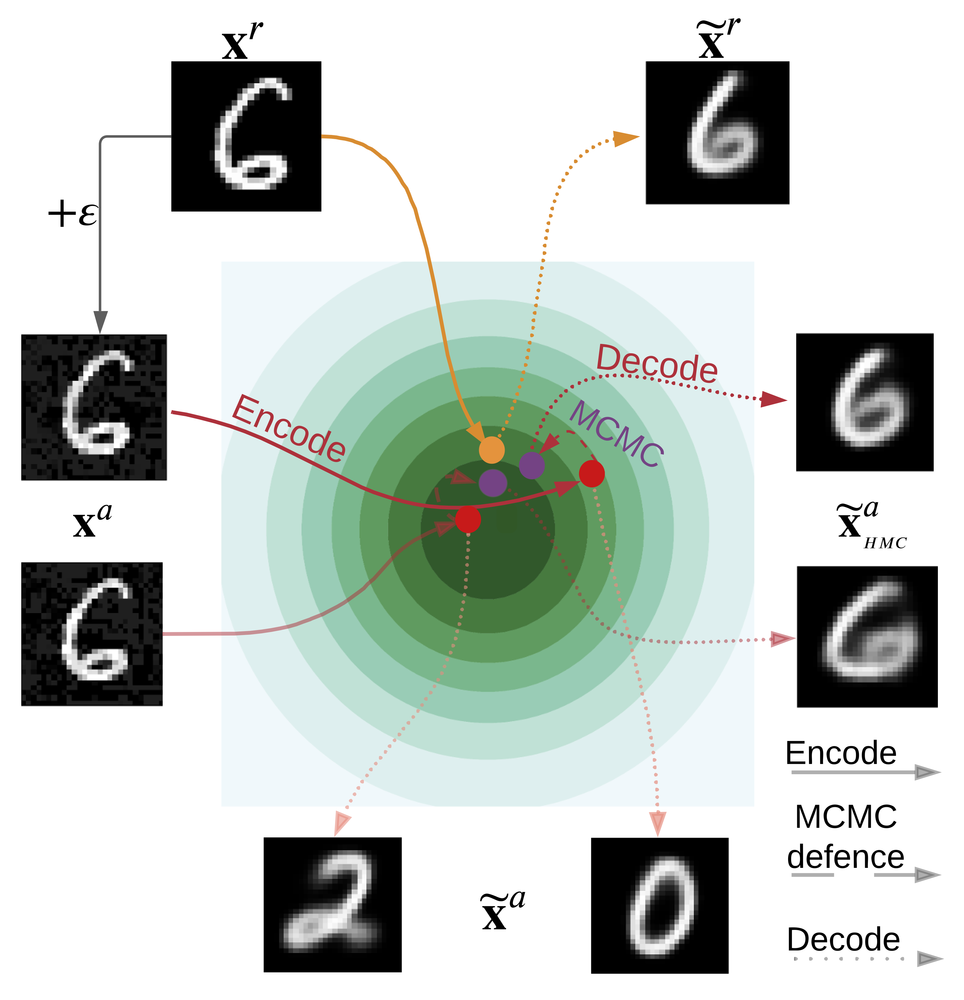

# Alleviating Adversarial Attacks on Variational Autoencoders with MCMC

This repository contains the code for the experiments from the paper:

[Alleviating Adversarial Attacks on Variational Autoencoders with MCMC](https://arxiv.org/abs/2203.09940)

**[Anna Kuzina](https://akuzina.github.io/), [Max Welling](https://staff.fnwi.uva.nl/m.welling/), [Jakub M. Tomczak](https://jmtomczak.github.io/)**

---
## Abstract
<table>
<tr>
<td style="width:10%">
<i>
Variational autoencoders (VAEs) are latent variable models that can generate complex objects and provide meaningful latent representations. Moreover, they could be further used in downstream tasks such as classification. As previous work has shown, one can easily fool VAEs to produce unexpected latent representations and reconstructions for a visually slightly modified input. Here, we examine several objective functions for adversarial attack construction proposed previously and present a solution to alleviate the effect of these attacks. Our method utilizes the Markov Chain Monte Carlo (MCMC) technique in the inference step that we motivate with a theoretical analysis. Thus, we do not incorporate any extra costs during training, and the performance on non-attacked inputs is not decreased. We validate our approach on a variety of datasets (MNIST, Fashion MNIST, Color MNIST, CelebA) and VAE configurations ($\beta$-VAE, NVAE, $\beta$-TCVAE), and show that our approach consistently improves the model robustness to adversarial attacks.
</i>
</td>
<td>
<p align="center">
  
</p>
</td>
</tr>
</table>

## Experiments 
### Environment Setup
We list the required packages in `conda_requirements.yaml`:
```bash
conda env create -f conda_requirements.yaml
```

### Weights and Biases Setup
We use [w&b](https://wandb.ai) to track experiments, save and load trained models, thus it is required to run the code. 
Variables `USER`, `PROJECT` and `API_KEY` in the `utils/wandb.py` script should be specified before running the experiments.  

### Train VAE
Full list of hyperpaamters and their descriptions can be found in `config.py`

The folder `runs` contains bash-scripts, which can be used to run all the experiments. 
E.g. to train $\beta$-VAE on mnist dataset one can used this command:

```bash
bash runs/MNIST/train_vae.sh
```

The command below can be used to train $\beta$-TCVAE:
```bash
bash runs/MNIST/train_tc_vae.sh
```

### Attack VAE
To run adversarial attacks on VAE without defence:
```bash
bash runs/MNIST/attack.sh
```

And with the defence:
```bash
bash runs/MNIST/attack_and_defend.sh
```

### Cite
If you found this work useful in your research, please consider citing:

```text
@article{kuzina2022alleviating,
  title={Alleviating Adversarial Attacks on Variational Autoencoders with MCMC},
  author={Kuzina, Anna and Welling, Max and Tomczak, Jakub M},
  journal={36th Conference on Neural Information Processing Systems (NeurIPS 2022)},
  year={2022}
}
```
### Acknowledgements
This research was (partially) funded by the Hybrid Intelligence Center, a 10-year programme funded by the Dutch Ministry of Education, Culture and Science through the Netherlands Organisation for Scientific Research, https://hybrid-intelligence-centre.nl.

This work was carried out on the Dutch national infrastructure with the support of SURF Cooperative.
